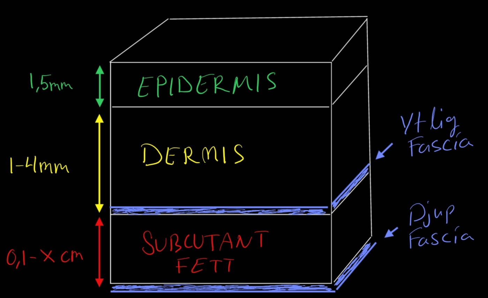
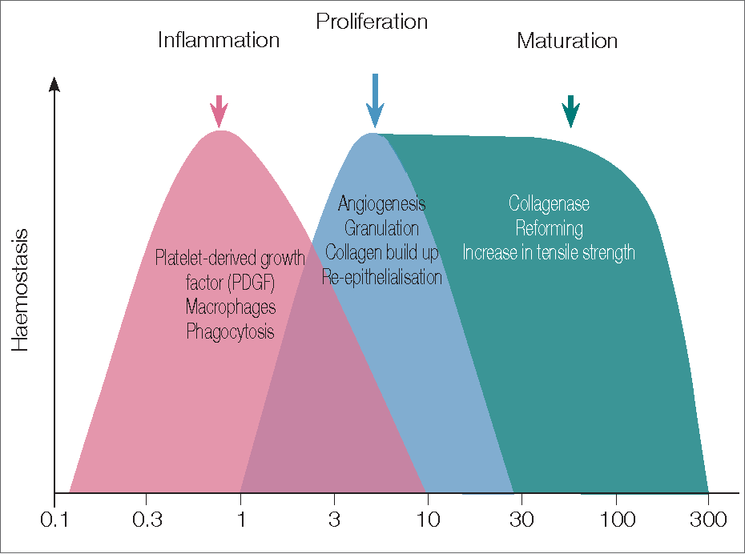
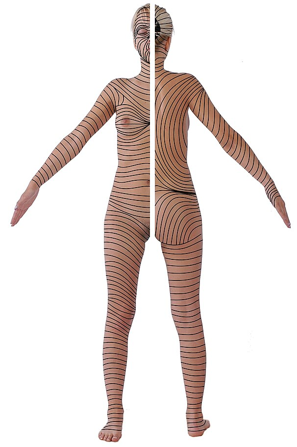
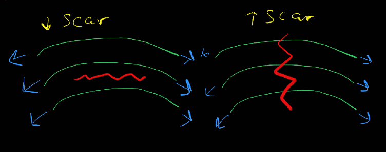
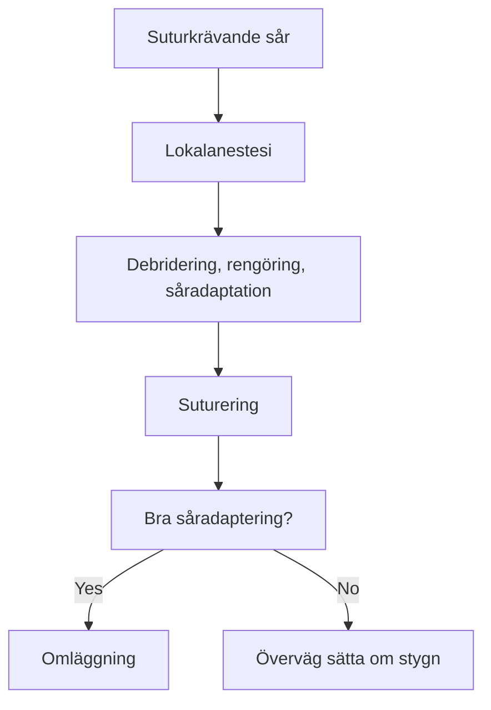

# Sårvård på akuten

::: info Översiktlig kunskap och handläggning av traumatiskt orsakade sår. 
Sårklassifikation, sårhantering, suturering, antibiotika. Denna korta artikel ska ge klinikern en känsla för enklare sårhantering på akuten.  
Som källa används huvudsakligen _Rosens Emergency Medicine, 10th ed, chapter 50_. 
:::

## <gr> Hudbiologi </gr>

### <ye> Anatomi </ye> ###
::: details Hudanatomi

:::

|  Hudlager                                 | Egenskaper                  | 
| -------------                             | :----------------------            | 
| <gr> **Epidermis** </gr>                  | <ul><li>Ytterst</li><li>Skyddande barriär</li><li>Flera lager</li></ul>         | 
| <ye> **Dermis** </ye>                     | <ul><li>Vävnadsstyrka</li><li>Elasticitet</li><li>Kärl, nerver, hårfolliklar, och körtlar</li></ul>       | 
| <re> **Subkutis (hypodermis)** </re>      | <ul><li>Fett och bindväv</li><li>Insulation</li><li>Energilager</li><li>Stötdämpning</li></ul>        | 

::: danger FASCIOR
Viktigt att ytlig och djup fascia rengörs och debrideras ordentligt. Här finns hög risk för att infektion utvecklas och sprids. Dessa kan snabbt övergå till allvarliga infektioner. Om djupa fascian är skadad skall denna repareras innan sårförslutning.
:::

### <ye> Läkningsfaser </ye> ###
::: details Graf

Källa: “SKIN FUNCTION AND WOUND HEALING PHYSIOLOGY.” (2006).
:::
|  Tid från skada                       | Processer                                                               | Sårkarakteristika
| -------------                          | :--------------------                                                   | :---   
|<ye> 0-1 d HEMOSTAS</ye>                |  <ul><li>Vasokonstriktion</li><li>Koagulation</li><li>Fibrinnät </li></ul>| <ul><li>Mycket instabilt</li><li> Hög risk att det öppnas </li></ul>  
| <re>1-3 d INFLAMMATION</re>       |  <ul><li>Vasodilatation</li><li> Migrering av WBC</li><li> Frisättning tillväxtfaktorer</li></ul> | <ul><li> Rubor, calor, tumor</li><li> Svagt och instabilt</li><li>Fibrinnät som skyddar</li></ul>  
| <bl>3-7 d PROLIFERATION</bl>      |    <ul><li>Angiogenes</li><li>Fibroblastaktivitet</li><li>Re-epitelialisering</li><li>Såret krymper</li></ul>  | <ul><li>Granulationsvävnad, röd, lättblödande</li><li>Fortsatt svagt sår men har integritet</li></ul>
| <gr>> 2 v REMODELLERING</gr>      | <ul><li>Cross-linking av kollagen</li><li>Hämning angiogenes</li></ul>        | <ul><li> Ärrbildning</li><li>< 3 veckor: < 20% ursprungsstyrka</li><li>< 4 mån: 60% av ursprungsstyrka</li><li> Hållfasthet når totalt 80% från ursprunget</li></ul>   

::: info Epitelialisering
<ul>
    <li>Epitel migrerar redan timmar efter sårskada. Orenheter förhindrar denna process. Såret ska vara <i>rent</i>, <i>fuktigt</i>, och <i>skyddat</i>.  </li>
    <li>Om suturering sker < 48h börjar såret redan se läkt ut efter 5 dagar.</li>
</ul>
:::

### <ye>  Hudens spänningslinjer (Langerlinjer eller Skin tension lines) </ye> ###
::: details Langerlinjer

Källa: José María Arribas Blanco, Shabnan Habibi, Nuria Rodríguez Pata and José Ramón Castello - (2016). "Integrated Activities in Primary Care – Minor Surgery in Family Medicine". 
:::
Sår som går rätvinkligt i förhållande till langerlinjerna producerar större ärr eftersom den högre tensionskraften försvårar läkningen. Det är därför fördelaktigt att vid kirurgiskt orsakade sår röra sig parallellt med langerlinjerna för att minimera ärrbildning.

## <gr> Sårklassificering </gr>

::: info Det är av hög vikt att man lär sig kategorisera typen av sårskada man har framför sig. Beskedliga sår kan missbedömas och leda till djupa infektioner om man inte känner till riskfaktorer och sårmekanismer.
:::

### <ye>Surgical Wound Classification (SWC), Center for disease control (CDC)</ye> ###

| Sårklass                            | Fynd                                                                              | Infektionsrisk % Surgical site infection (SSI) 
| ---------------                     | :---------------                                                                |:-------------:   |
| Klass 1 Rent                 | <ul><li>Ingen inflammation</li><li>Sterilt</li><li>Primärförslutning</li></ul> |1 - 5                  |   
| Klass 2 Rent-kontaminerat    | <ul><li>Slemhinnor</li><li>Ingen främmande kropp</li><li>Sterilteknik</li></ul>   |   3 - 11              | 
| Klass 3 Kontaminerat         | <ul><li><re>Oavsiktligt öppet sår</re></li><li>Bruten sterilteknik</li><li>GI kontaminering</li><li>Icke-purulent inflammation</li></ul>                    |  10 - 17               |                
| Klass 4 Smutsigt/infekterat  | <ul><li>Gammalt traumatiskt sår  med icke-viabel vävnad </li><li>Infektionstecken</li><li>Främmande föremål</li></ul>                    |      27           |
 ::: details Källa
 Herman TF, Popowicz P, Bordoni B. Wound Classification. [Updated 2023 Aug 17]. In: StatPearls [Internet]. Treasure Island (FL): StatPearls Publishing; 2025 Jan-. Available from: https://www.ncbi.nlm.nih.gov/books/NBK554456/
:::

Vi kommer ägna oss huvudsakligen åt klass 3 och 4 sår då alla öppna oavsiktliga traumatiska sår betraktas som minst grad 3.

### <ye> Traumatiska sårtyper </ye> ###

| Typ | Mekanism | Djup | Risk |
|:--|:-----|:--|:--|
| Abrasion (skrapsår)| Hudskrapning/hudflåning | Ytlig | Infektion|
| Laceration  (Kött-, skär-, rivsår)  | Trubbig, slitning, skärning | Ytlig - djup | Blödning/infektion|
| Avulsion (Avslitning, degloving)| Kraftig slitning | Djup | Stor vävnads förlust |
| Punktion (puncture) | Bett, taggar, nålar | Djup | Infektion |
| Penetration | Kniv, kulor | Djup | Intern organskada |
| Kontusion | Trubbigt | Subkutant | Hematom |

## <gr> Anamnes </gr>

::: info För att kunna prognosticera sårets läkningsförmåga och infektionsrisken behöver man ta en god sjukdomshistoria. Detta kan vara avgörande för vilka åtgärder man väljer.
:::  

### <ye> Tidigare / nuvarande sjukdomar / aktuellt </ye>

- Perifer kärlsjukdom (ffa diabetes och claudicatio)
- Immunosupprimerad
- Främmande föremål
- Tetanusstatus

### <re> Riskfaktorer som ökar infektionsrisk </re>

- Efter 6 - 12 timmar har man traditionellt betraktat ett sår som klass 4. Detta är omdebatterat idag då sårrengöring blivit så mycket bättre.
- Krosskada: Ofta rejält skadad vävnad utöver huden. Minskat blodflöde till sårkanterna. Ökar bakteriebördan upp till 100 gånger.
- \> 5 cm lång sårskada
- Djup sårskada (> 6 mm; man kan se subcutis)
- \> 65 år
- Höghastighetsprojektil
- Kontaminering: Saliv, jord, feces.
- Punktionsskada (bett, tagg)

::: warning Viktiga beaktanden
- Primärsutur ska ske inom 8 - 12h. Data pekar dock på att timingen inte är lika viktig som dom andra riskfaktorerna eftersom rengöring och debridering blivit så pass bra.
- Fina och rena ansiktssår kan primärförslutas > 24h efter skadan
:::

### <ye> Sårlokalisation </ye> 

Sårlokalisation är en av dom viktigaste faktorerna vid bedömning av infektionsrisk. Lår och framförallt underben har högst risk då kroniska sjukdomar ofta skadar kärl och hudstrukturen kring ankel och underben. Dåliga förutsättningar för sårläkning. Detta gör det särskilt riskabelt om kontamination föreligger.

| Lokalisation | Infektionsrisk efter suturering |
| :---|:----:|
| Ansikte + skalp | < 4% |
| Torso + andra extremiteter | > 10% |
| Lår/underben | <re><b>> 20%</b></re> |

Risk för infektion: Underben > lår > armar > fötter > bröst > rygg > ansikte > skalp

::: tip Det är den sammanvägda bedömningen med alla dessa faktorer som ska ligga till grund för klinikern om såret ska förslutas och om antibiotika är aktuellt.
:::

## <gr> Status och Radiologi </gr>

::: info Ibland kan det vara klurigt att förstå såret och se den för vad den är; framförallt om den blöder och ändrar skepnad hela tiden. Hemostas kan därför blottgöra och förenkla såråskådningen. 
På en sårskadad extremitet kan en blodtrycksmanschett  användas med fördel proximalt om såret samtidigt som man höjer extremiteten 1-2 minuter. Manschetten kan vara på 2 timmar om man så önskar, men sannolikt så kommer patienten vara i så pass mycket smärta att det är självbegränsande.
::: 

::: tip Främmande föremål
Om man misstänker att ett föremål tagit sig in på djupet men man kan inte se eller palpera den så kan man med fördel nyttja olika typer av radiologi. Valet av bildmodalitet blir beroende på vad för objekt man misstänker. 
- Traditionell slätröntgen hittar: Metall 99%; Glas 75%;  Trä 7%.
- CT Ser alla typer av främmande föremål vilket gör den golden standard. De uppenbara negativa aspekterna är strålning och kostnad.
- Ultraljud: Bra men kan ibland ge dåligt resultat pga små föremål, luft, ödem, pus, blod, kalcifieringar.
:::

## <gr>Handläggning</gr>

::: info Nu kommer vi till den viktigaste delen i artikeln, nämligen hur vi stegvis handlägger ett sår.
:::
### <ye>Översikt</ye>

