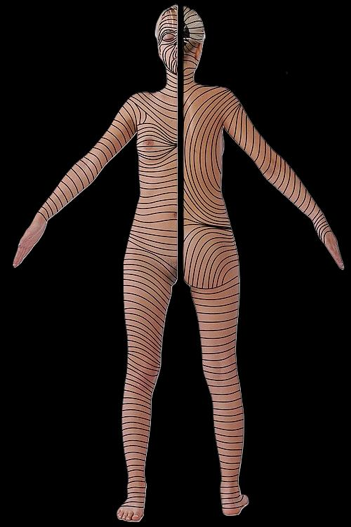

# Sårvård på akuten

::: info Översiktlig kunskap och handläggning för traumatiskt orsakade sår. 
Sårklassifikation, sårhantering, suturering, antibiotika. Denna korta artikel ska ge klinikern en känsla för enklare sårhantering på akuten.  
Som källa används huvudsakligen _Rosens Emergency Medicine, 10th ed, chapter 50_. 
:::

## <gr> Hudbiologi </gr>

### <ye> Anatomi </ye> ###
::: details Hudanatomi

:::

|  Hudlager                                 | Egenskaper                  | 
| -------------                             | :----------------------            | 
| <gr> **Epidermis** </gr>                  | <ul><li>Ytterst</li><li>Skyddande barriär</li><li>Flera lager</li></ul>         | 
| <ye> **Dermis** </ye>                     | <ul><li>Vävnadsstyrka</li><li>Elasticitet</li><li>Kärl, nerver, hårfolliklar, och körtlar</li></ul>       | 
| <re> **Subkutis (hypodermis)** </re>      | <ul><li>Fett och bindväv</li><li>Insulation</li><li>Energilager</li><li>Stötdämpning</li></ul>        | 

::: danger FASCIOR
Viktigt att ytlig och djup fascia rengörs och debrideras ordentligt. Här finns hög risk för att infektion utvecklas och sprids. Dessa kan snabbt övergå till allvarliga infektioner. Om djupa fascian är skadad skall denna repareras innan sårförslutning.
:::

### <ye> Läkningsfaser </ye> ###
::: details Graf

Källa: “SKIN FUNCTION AND WOUND HEALING PHYSIOLOGY.” (2006).
:::
|  Tid från skada                       | Processer                                                               | Sårkarakteristika
| -------------                          | :--------------------                                                   | :---   
|<ye> 0-1 d HEMOSTAS</ye>                |  <ul><li>Vasokonstriktion</li><li>Koagulation</li><li>Fibrinnät </li></ul>| <ul><li>Mycket instabilt</li><li> Hög risk att det öppnas </li></ul>  
| <re>1-3 d INFLAMMATION</re>       |  <ul><li>Vasodilatation</li><li> Migrering av WBC</li><li> Frisättning tillväxtfaktorer</li></ul> | <ul><li> Rubor, calor, tumor</li><li> Svagt och instabilt</li><li>Fibrinnät som skyddar</li></ul>  
| <bl>3-7 d PROLIFERATION</bl>      |    <ul><li>Angiogenes</li><li>Fibroblastaktivitet</li><li>Re-epitelialisering</li><li>Såret krymper</li></ul>  | <ul><li>Granulationsvävnad, röd, lättblödande</li><li>Fortsatt svagt sår men har integritet</li></ul>
| <gr>> 2 v REMODELLERING</gr>      | <ul><li>Cross-linking av kollagen</li><li>Hämning angiogenes</li></ul>        | <ul><li> Ärrbildning</li><li>< 3 veckor: < 20% ursprungsstyrka</li><li>< 4 mån: 60% av ursprungsstyrka</li><li> Hållfasthet når totalt 80% från ursprunget</li></ul>   

::: info Epitelialisering
<ul>
    <li>Epitel migrerar redan timmar efter sårskada. Orenheter förhindrar denna process. Såret ska vara <i>rent</i>, <i>fuktigt</i>, och <i>skyddat</i>.  </li>
    <li>Om suturering sker < 48h börjar såret redan se läkt ut efter 5 dagar.</li>
</ul>
:::

### <ye>  Hudens spänningslinjer (Langerlinjer eller Skin tension lines) </ye> ###
::: details Langerlinjer

Källa: José María Arribas Blanco, Shabnan Habibi, Nuria Rodríguez Pata and José Ramón Castello - (2016). "Integrated Activities in Primary Care – Minor Surgery in Family Medicine". 
:::
Sår som går rätvinkligt i förhållande till langerlinjerna producerar större ärr eftersom den högre tensionskraften försvårar läkningen. Det är därför fördelaktigt att vid kirurgiskt orsakade sår röra sig parallellt med langerlinjerna för att minimera ärrbildning.

## <gr> Sårklassificering </gr>

::: info Det är av hög vikt att man lär sig kategorisera typen av sårskada man har framför sig. Beskedliga sår kan missbedömas och leda till djupa infektioner om man inte känner till riskfaktorer och sårmekanismer.
:::

### <ye>Surgical Wound Classification (SWC), Center for disease control (CDC)</ye> ###

| Sårklass                            | Fynd                                                                              | Infektionsrisk % Surgical site infection (SSI) 
| ---------------                     | :---------------                                                                |:-------------:   |
| Klass 1 Rent                 | <ul><li>Ingen inflammation</li><li>Sterilt</li><li>Primärförslutning</li></ul> |1 - 5                  |   
| Klass 2 Rent-kontaminerat    | <ul><li>Slemhinnor</li><li>Ingen främmande kropp</li><li>Sterilteknik</li></ul>   |   3 - 11              | 
| Klass 3 Kontaminerat         | <ul><li><re>Oavsiktligt öppet sår</re></li><li>Bruten sterilteknik</li><li>GI kontaminering</li><li>Icke-purulent inflammation</li></ul>                    |  10 - 17               |                
| Klass 4 Smutsigt/infekterat  | <ul><li>Gammalt traumatiskt sår  med icke-viabel vävnad </li><li>Infektionstecken</li><li>Främmande föremål</li></ul>                    |      27           |
 ::: details Källa
 Herman TF, Popowicz P, Bordoni B. Wound Classification. [Updated 2023 Aug 17]. In: StatPearls [Internet]. Treasure Island (FL): StatPearls Publishing; 2025 Jan-. Available from: https://www.ncbi.nlm.nih.gov/books/NBK554456/
:::

Vi kommer ägna oss huvudsakligen åt klass 3 och 4 sår då alla öppna oavsiktliga traumatiska sår betraktas som minst grad 3.

### <ye> Traumatiska sårtyper </ye> ###

| Typ | Mekanism | Djup | Risk |
|:--|:-----|:--|:--|
| Skrapsår (abrasion)| Hudskrapning/hudflåning | Ytlig | Infektion|
| Kött-, skär-, rivsår (laceration) | Trubbig, slitning, skärning | Ytlig - djup | Blödning/infektion|
| Avslitning (avulsion, degloving)| Kraftig slitning | Djup | Stor vävnads förlust |
| Punktion (puncture) | Bett, taggar, nålar | Djup | Infektion |
| Penetration | Kniv, kulor | Djup | Intern organskada |
| Kontusion | Trubbigt | Subkutant | Hematom |

## <gr> Sårtyper </gr>

### <ye> Anamnes </ye>

### <ye> Status </ye>

### <ye> Lab </ye>

### <ye> Scoringsystem </ye>

### <ye> Bilddiagnostik </ye>
