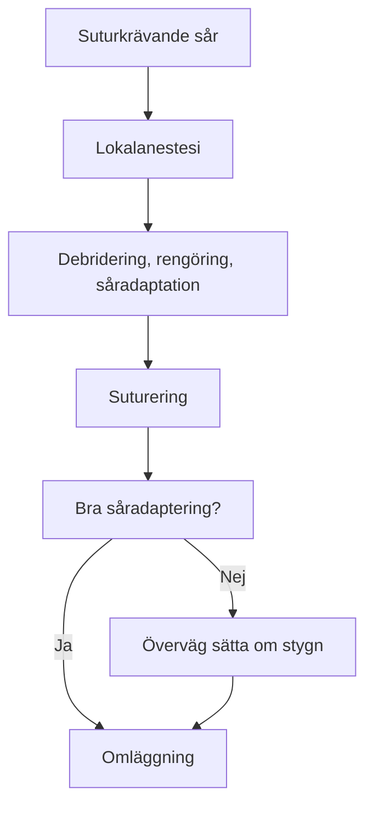
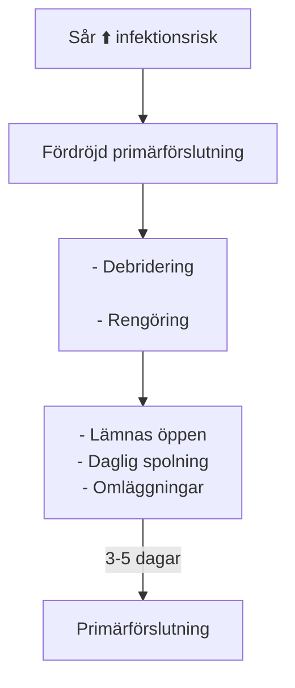

# Sårvård på akuten

::: info Översiktlig kunskap och handläggning av traumatiskt orsakade sår. 
Sårklassifikation, sårhantering, suturering, antibiotika. Denna korta artikel ska ge klinikern en känsla för enklare sårhantering på akuten.  
Som källa används huvudsakligen _Rosens Emergency Medicine, 10th ed, chapter 50_. 
:::

## HUDBIOLOGI 

###  Anatomi 
::: details Hudanatomi

:::

|  Hudlager                                 | Egenskaper                  | 
| -------------                             | :----------------------            | 
| <gr> **Epidermis** </gr>                  | <ul><li>Ytterst</li><li>Skyddande barriär</li><li>Flera lager</li></ul>         | 
| <ye> **Dermis** </ye>                     | <ul><li>Vävnadsstyrka</li><li>Elasticitet</li><li>Kärl, nerver, hårfolliklar, och körtlar</li></ul>       | 
| <re> **Subkutis (hypodermis)** </re>      | <ul><li>Fett och bindväv</li><li>Insulation</li><li>Energilager</li><li>Stötdämpning</li><li>Större kärl och nerver</li></ul>        | 

::: danger FASCIOR
Viktigt att ytlig och djup fascia rengörs och debrideras ordentligt. Här finns hög risk för att infektion utvecklas och sprids. Dessa kan snabbt övergå till allvarliga infektioner. Om djupa fascian är skadad skall denna repareras innan sårförslutning.
:::

###  Läkningsfaser 
::: details Graf

Källa: “SKIN FUNCTION AND WOUND HEALING PHYSIOLOGY.” (2006).
:::
|  Tid från skada                       | Processer                                                               | Sårkarakteristika
| -------------                          | :--------------------                                                   | :---   
|<ye> 0-1 d HEMOSTAS</ye>                |  <ul><li>Vasokonstriktion</li><li>Koagulation</li><li>Fibrinnät </li></ul>| <ul><li>Mycket instabilt</li><li> Hög risk att det öppnas </li></ul>  
| <re>1-3 d INFLAMMATION</re>       |  <ul><li>Vasodilatation</li><li> Migrering av WBC</li><li> Frisättning tillväxtfaktorer</li></ul> | <ul><li> Rubor, calor, tumor</li><li> Svagt och instabilt</li><li>Fibrinnät som skyddar</li></ul>  
| <bl>3-7 d PROLIFERATION</bl>      |    <ul><li>Angiogenes</li><li>Fibroblastaktivitet</li><li>Re-epitelialisering</li><li>Såret krymper</li></ul>  | <ul><li>Granulationsvävnad, röd, lättblödande</li><li>Fortsatt svagt sår men har integritet</li></ul>
| <gr>> 2 v REMODELLERING</gr>      | <ul><li>Cross-linking av kollagen</li><li>Hämning angiogenes</li></ul>        | <ul><li> Ärrbildning</li><li>< 3 veckor: < 20% ursprungsstyrka</li><li>< 4 mån: 60% av ursprungsstyrka</li><li> Hållfasthet når totalt 80% från ursprunget</li></ul>   

::: info Epitelialisering
<ul>
    <li>Epitel migrerar redan timmar efter sårskada. Orenheter förhindrar denna process. Såret ska vara <i>rent</i>, <i>fuktigt</i>, och <i>skyddat</i>.  </li>
    <li>Om suturering sker < 48h börjar såret redan se läkt ut efter 5 dagar.</li>
</ul>
:::

###   Langerlinjer (Skin tension lines)
::: details Langerlinjer

Källa: José María Arribas Blanco, Shabnan Habibi, Nuria Rodríguez Pata and José Ramón Castello - (2016). "Integrated Activities in Primary Care – Minor Surgery in Family Medicine". 
:::
Sår som går rätvinkligt i förhållande till langerlinjerna producerar större ärr eftersom den högre tensionskraften försvårar läkningen. Det är därför fördelaktigt att vid kirurgiskt orsakade sår röra sig parallellt med langerlinjerna för att minimera ärrbildning.

##  SÅRKLASSIFICERING 

::: info Det är av hög vikt att man lär sig kategorisera typen av sårskada man har framför sig. Beskedliga sår kan missbedömas och leda till djupa infektioner om man inte känner till riskfaktorer och sårmekanismer.
:::

### Surgical Wound Classification (SWC), Center for disease control (CDC)

| Sårklass                            | Fynd                                                                              | Infektionsrisk % Surgical site infection (SSI) 
| ---------------                     | :---------------                                                                |:-------------:   |
| Klass 1 Rent                 | <ul><li>Ingen inflammation</li><li>Sterilt</li><li>Primärförslutning</li></ul> |1 - 5                  |   
| Klass 2 Rent-kontaminerat    | <ul><li>Slemhinnor</li><li>Ingen främmande kropp</li><li>Sterilteknik</li></ul>   |   3 - 11              | 
| Klass 3 Kontaminerat         | <ul><li><re>Oavsiktligt öppet sår</re></li><li>Bruten sterilteknik</li><li>GI kontaminering</li><li>Icke-purulent inflammation</li></ul>                    |  10 - 17               |                
| Klass 4 Smutsigt/infekterat  | <ul><li>Gammalt traumatiskt sår  med icke-viabel vävnad </li><li>Infektionstecken</li><li>Främmande föremål</li></ul>                    |      27           |
 ::: details Källa
 Herman TF, Popowicz P, Bordoni B. Wound Classification. [Updated 2023 Aug 17]. In: StatPearls [Internet]. Treasure Island (FL): StatPearls Publishing; 2025 Jan-. Available from: https://www.ncbi.nlm.nih.gov/books/NBK554456/
:::

Vi kommer ägna oss huvudsakligen åt klass 3 och 4 sår då alla öppna oavsiktliga traumatiska sår betraktas som minst grad 3.

###  Traumatiska sårtyper 

| Typ | Mekanism | Djup | Risk |
|:--|:-----|:--|:--|
| Abrasion (skrapsår)| Hudskrapning/hudflåning | Ytlig | Infektion|
| Laceration  (Kött-, skär-, rivsår)  | Trubbig, slitning, skärning | Ytlig - djup | Blödning/infektion|
| Avulsion (Avslitning, degloving)| Kraftig slitning | Djup | Stor vävnads förlust |
| Punktion (puncture) | Bett, taggar, nålar | Djup | Infektion |
| Penetration | Kniv, kulor | Djup | Intern organskada |
| Kontusion | Trubbigt | Subkutant | Hematom |

## ANAMNES 

::: info För att kunna prognosticera sårets läkningsförmåga och infektionsrisken behöver man ta en god sjukdomshistoria. Detta kan vara avgörande för vilka åtgärder man väljer.
:::  

###  Tidigare / nuvarande sjukdomar / aktuellt 

- Perifer kärlsjukdom (ffa diabetes och claudicatio)
- Immunosupprimerad
- Främmande föremål
- Tetanusstatus

###  Riskfaktorer som ökar infektionsrisk 

- Efter 6 - 12 timmar har man traditionellt betraktat ett sår som klass 4. Detta är omdebatterat idag då sårrengöring blivit så mycket bättre.
- Krosskada: Ofta rejält skadad vävnad utöver huden. Minskat blodflöde till sårkanterna. Ökar bakteriebördan upp till 100 gånger.
- \> 5 cm lång sårskada
- Djup sårskada (> 6 mm; man kan se subcutis)
- \> 65 år
- Höghastighetsprojektil
- Kontaminering: Saliv, jord, feces.
- Punktionsskada (bett, tagg)

::: warning VIKTIGA BEAKTANDEN
- Primärsutur ska ske inom 8 - 12h. Data pekar dock på att timingen inte är lika viktig som dom andra riskfaktorerna eftersom rengöring och debridering blivit så pass bra. UpToDate tycker det går bra upp till 18 timmar.
- Fina och rena ansiktssår kan primärförslutas > 24h efter skadan
:::

###  Sårlokalisation 

Sårlokalisation är en av dom viktigaste faktorerna vid bedömning av infektionsrisk. Lår och framförallt underben har högst risk då kroniska sjukdomar ofta skadar kärl och hudstrukturen kring ankel och underben. Dåliga förutsättningar för sårläkning. Detta gör det särskilt riskabelt om kontamination föreligger.

| Lokalisation | Infektionsrisk efter suturering |
| :---|:----:|
| Ansikte + skalp | < 4% |
| Torso + andra extremiteter | > 10% |
| Lår/underben | <re><b>> 20%</b></re> |

Risk för infektion: Underben > lår > armar > fötter > bröst > rygg > ansikte > skalp

::: tip VÅGMÄSTARE
Det är den sammanvägda bedömningen med alla dessa faktorer som ska ligga till grund för klinikern om såret ska förslutas och om antibiotika är aktuellt.
:::

## STATUS & RADIOLOGI

::: info ATT FÖRSTÅ SÅRET
Ibland kan det vara klurigt att förstå såret och se den för vad den är; framförallt om den blöder och ändrar skepnad hela tiden. Hemostas kan därför blottgöra och förenkla såråskådningen. 

På en sårskadad extremitet kan en blodtrycksmanschett  användas med fördel proximalt om såret samtidigt som man höjer extremiteten 1-2 minuter. Manschetten kan vara på 2 timmar om man så önskar, men sannolikt så kommer patienten vara i så pass mycket smärta att det är självbegränsande.
::: 

::: tip FRÄMMANDE FÖREMÅL
Om man misstänker att ett föremål tagit sig in på djupet men man kan inte se eller palpera den så kan man med fördel nyttja olika typer av radiologi. Valet av bildmodalitet blir beroende på vad för objekt man misstänker. 
- <ye><b>SLÄTRÖNTGEN</b></ye> 
      Metall 99%; Glas 75%;  Trä 7%. 
- <ye><b>SKIKTRÖNTGEN, CT </b></ye>
     Ser alla typer av främmande föremål vilket gör den golden standard. De uppenbara negativa aspekterna är strålning och kostnad. 
- <ye><b>ULTRALJUD</b></ye>
     Bra men kan ibland ge dåligt resultat pga små föremål, luft, ödem, pus, blod, kalcifieringar. 
:::

## HANDLÄGGNING

::: info Nu kommer vi till den viktigaste delen i artikeln, nämligen hur vi stegvis handlägger ett sår.
:::
### Översikt

### Lokalanestesi

####  Val av lokalanestetikum 
::: info SÅRSKADOR PÅ AKUTEN
MEPIVAKAIN (**Carbocain®**)  
LIDOCAIN (**Xylocain®**)  
:::

| Typ | Anslagstid | Duration | Rimlig dos | 
|:----|:----------|:--------|:------|
| Mepivakain| <ul><li>Sekunder</li></ul>|<ul><li>1,5 - 4 h</li></ul>| <ul><li>1-20 ml (10 mg/ml)</li><li>5 mg/kg (maxdos)</li></ul>|
| Lidokain| <ul><li>Sekunder</li></ul>|<ul><li>20-60 minuter</li><li>2-6 h (adrenalin)</li></ul>| <ul><li> 5-40 ml (10 mg/ml)</li><li>4 mg/kg (maxdos)</li><li>7 mg/kg (adrenalin)</li></ul>|

::: details VARFÖR MEPIVAKAIN > LIDOKAIN
* Liknande anslagstid
* Längre duration
* Samma potens
* Mindre toxicitet
* Ej beroende av adrenalin i lika hög grad
:::

::: tip BUFFRA
Carbocain är löst i en låg pH-lösning (pH 4,5 - 6). Agerar antimikrobiellt. Detta betyder också att det gör extra ont vid injektion. Man kan tillsätta 1-2 ml 0,6 M Natriumbikarbonat till 10 ml carbocain.
:::
::: danger ADRENALIN
Fördröjer läkningsperioden. Ökar infektionsrisk. Om högrisksår med omfattande vävnadsskada: överväg avstå adrenalin.
:::

####  Allergi 

::: info 2 familjer inom lokalanestesi
* Amider (Lidokain, Mepivakain, Bupivakain)  
* Estrar (Prokain, Tetrakain, Benzokain)
:::

::: warning KORSREAGERAR INTE
Vid osäkerhet om allergi, injicera 0,1 ml och utvärdera efter 30min
:::

####  Injektionsteknik 

::: details Skolans misslyckande
Av någon bisarr orsak missade jag PM:et där det skall ha framgått att lokalanestesin INTE ska infiltreras i epidermis. Tyckte alltid det var lite märkligt att jag ofta jobbade mot så djävulskt mycket motstånd vid injektionsmomentet. Rent anatomiskt är detta mycket enkelt att förklara. Som beskrivet i denna artikels första del [Anatomi](#anatomi), finner vi sensoriska nervstruktur i dermis/subcutis och INTE i epidermis. Av mycket logiska skäl innebär detta givetvis att vi skall infiltrera djupa delen av dermis (mindre spridning) alternativt ytliga delen av subcutis (större spridning).  
:::

Ett bra nålval som har ett balanserat injektionsflöde (smärta kontra hastighet) är en 23 Gauge nål. I svenska termer motsvarar detta en blå nål. .

När vi har en sårskada framför oss finns det två tillvägagångssätt. Antingen betraktas såret tillräkligt rent för att vi ska kunna injicera direkt i sårkanterna (förslagsvis ytliga delen av subcutis). Detta kommer vara majoriteten av sår och är mindre smärtsamt. I annat fall kan såret vara så skitigt att man kan riskera dra med sig smuts in i vävnaden. Detta vill vi absolut inte göra eftersom vi i princip gödslar med potentiellt infektionsmaterial.

Om du sticker perkutant (via huden), se till att denna är rengjord, förslagsvis med tvål och vatten. Om du är lite ångestladdad kan man även, MED FÖRSIKTIGTHET, använda klorhexidin på frisk hud. Klorhexidin skadar öppna sårytor och förlänger läkning. Sen gör det sinnessjukt ont för patienten

En generellt bra teknik är att man sticker in hela vägen längst med sårkanten tills man når basen av nålen. Därefter aspirerar man, backar långsamt, samtidigt som man injicerar lokalanestesi. Djupet bör vara ungefär 5 mm för att adekvat nå rätt del av dermis/subcutis.

####  Kort om finger-tåblockad och adrenalin 

::: info Sannolikt inte farlig
Tes: Vasokonstriktion av endarterioler -> ischemi  
Case studies från handkirurgi: Säkert med försiktig monitorering. Reverseras med lokalinjektion 0,5 - 2 mg subkutant phentolamin alternativt topikal nitroglycerin.

Om det är svårt att ha blodfritt arbetsfält kan man överväga att tornikera fingret/tån på dess bas med exempelvis ett bandage.
:::

### Sårhantering

::: info Efter man har framgångsrikt välsignat området med lokal analgesi kan sårtvätt börja. Plåga inte patienten i onödan.
:::

####  Debridering och sårtvätt 

::: info DEBRIDERING
Debridering är i särklass ett av dom viktigaste momenten i sårvård. Om kroppsfrämmande föremål och partiklar missas i sår finns en skälig risk att ingen adekvat läkning sker samtidigt som infektionsrisken ökar dramatiskt. Utöver detta kan sårläkning ske på ett ofördelaktigt sätt vilket förändrar anatomin på ett estetiskt eller funktionellt olämpligt vis. 
:::

::: tip SÅRTVÄTT
Efter man plockat bort större och uppenbara föroreningar kommer nästa viktiga steg, vilket är att man tvättar rent såret. Här kan man med fördel använda ljummet kranvatten blandat med tvål. Effektmässigt är kranvatten jämförbart med koksalt. Kranvatten är i princip gratis och lättillgängligt. Koksalt kan reserveras till kirurgiskt sterila sår; sårskador på akuten betraktas redan som kontaminerade. 

Om man inte fysiskt skrubbar i såret ska ett spoltryck på 7 Psi uppnås, detta för att säkerställa att skräp och mikroorganismer sköljs bort utan att skada vävnaden ytterliggare. Ett enkelt sätt att säkerställa att man spolar rätt är att ansluta en 30 mL spruta med en 18G nål (rosa pvk eller röd uppdragningskanyl). Här rekommenderar jag att man använder PVK:n så man undviker skärande våld.
:::

::: warning HÅR
Hår är något av ett gissel vad gäller sårskador. Hamnar i såret, är i vägen när man suturerar, och gör det onödigt svårt. 

⭐ <gr>BÄST:</gr> Trimmer/sax.

OKEJ: Vaselin/oljig substans på sårkant = agerar hårprodukt.

🔴 <re>DÅLIG:</re> Rakhyvel. Skadar hårfolliklars infundibulum vilket skapar enkel bakterieacess. Infektionsrisk ökar 9-faldigt.
:::

### Sårförslutning

####  Primärförslutning  

- Ej infekterat  
- Tid < 12-18 h (rena ansiktssår upp till 48h)

#### Fördröjd primärförslutning

::: info Bra att veta
Samma läkningstid men dramatiskt reducerad infektionsrisk. Om extremitet, omlägges med skena. Oklart huruvida packning är fördelaktigt eller ej. Orsakar mer smärta utan uppenbar vinst. Återbesök 24h för sårkontroll och omläggningsbyte. 
:::

::: danger ANTIBIOTIKA GES INTE TILL DESSA SÅR
:::

### Suturtyper

Vi använder i första hand syntetiska suturer eftersom dom är till sin yta glatt (låg friktion) men har också som regel mycket låg vävnadsreaktivitet. Detta gör dem lätta att knyta men lite svårare att hantera eftersom de gärna vill tillbaks till sin ursprungsform - "suture memory". Det är viktigt man knyter med god teknik för att de inte ska gå upp.

::: details ETHILON
- Nylon (polyamide)
- Monofilament
- Icke-absorberbar
- Billig och i särklass den vanligaste suturen vi använder på akuten.
:::

::: details PROLENE
- Prolene (polypropylene) 
- Betraktas som den förfinade Ethilonsuturen
- Mer slitstark, håller sin form, och lämpar sig för långvarig användning in vivo
- Sällan indicerad på akuten
- Dyrare per sutur
:::

::: details VICRYL
- Polyglactin (vicryl)
- Flätad multifilament -> Hög draghållfasthet
- Svagt "suture memory"
- 30% svagare efter 2 veckor; 50% svagare efter 3 veckor; 75% svagare efter 4 veckor; absorberad efter 2 månader
:::

### Suturering

Här inkluderas de vanligaste och mest användbara sårförslutningsverktygen på en akutmottagning.

#### Suturer

::: warning Surgeon's knot
Samtliga suturer låses med 2-1-1 teknik. Första vändningen bestämmer suturens styrka. 2 slag för att övervinna "suture memory". Andra låser knuten. Tredje för säkerhetsmarginal. Demonstrationsvideos på samtliga suturer.
:::

::: details Enkelsutur

_Lämpar sig till i princip alla sår. Du kommer använda denna sutur i > 90% av såren du stöter på._
:::

::: details Stående madrass

_Vid djupare sår där resorberbartråd inte behövs._
:::

::: details Liggande madrass

_Vid sår där man vill sprida ut suturtensionen för att undvika att man drar igenom svag och skör hud. Lämpar sig bra för V-formade sår._
:::

::: details Fortlöpande utan låsning

_Kan används för raka lacerationer med låg infektionsrisk. Sparar tid. Nackdel är att man måste klippa bort hela tråden vid minsta problem som kräver sårrevision._
:::

::: details Y-sår

_Corner stitch._
:::

::: details V-sår                           

_Corner stitch._
:::

::: details V-sår med liggande madrass

_Liggande madrass istället för corner stitch._
:::

::: info STAPLING
Fungerar bra på fina och hyfsat raka lacerationer. Tidsvinst och billigare. Lägre infektionsrisk.
:::

::: tip PRAKTISK PATIENTINFORMATION SUTUR
- Duscha går bra
- Bada inte -> ökar risk för infektion
- Skrubba inte 
- Suturer tas bort hos distriktssköterska, sårlokalisation avgör tid
- Informera om infektion
:::

#### Suturtabell

| Lokal | Storlek | Längd (dagar) |
|:------|:--------|:------:|
| Ansikte |4-0, 5-0  |5-7   |
| Huvud, skalp | 3-0 | 7-10   |
| Thorax, buk, övre extr | 3-0, 4-0 | 10-12 |
| Rygg, nedre extr |  3-0, 4-0|14-17  |

#### Limning

::: details DermaFlex
Låg tröskel för användning på barn. Sannolikt underanvänt på akuten. Lämpar sig på följande:
- < 6 cm sår
- Sår med god hemostas, limmet fäster annars inte
- Gärna inte djupare än 1 cm
- Sårkanterna måste ha låg spänning, annars hög risk för att limmet släpper under läkning
- Låg dynamisk plats, ie INTE ÖVER LEDER, händer
- Stelnar efter 95 sekunder
- Försvinner efter 7 dagar
- LIM + SteriStrip är en kombination guld värd. Slitningssår, exempelvis hos äldre med tunn kortisonbehandlad hud så kan detta vara ett mycket bra alternativ.
:::

::: tip PRAKTISK PATIENTINFORMATION LIM
- Duscha går bra
- Bada inte -> ökar risk för infektion och kan lösgöra limmet
- Skrubba inte -> risk för att mekaniskt skrubba bort limmet
- Försvinner av sig självt efter 7 dagar
- Informera om infektion
:::

### OMLÄGGNING

Med tanke på att vi får nästan noll utbildning vad gäller såromläggning utgör detta alltför ofta ett problem när omvårdnadspersonal frågar "experten" vad för typ av förband som ska användas för respektive sår. Dessa förband finns tillgängliga på akuten. Kortfattade videodemonstrationer.

::: tip PRINCIPER
Skapa optimal sårläkningsmiljö -> värna om makrofager och fibroblaster
- Omläggning ska hålla såret fuktigt, goda förutsättningar för epitelialisering. Ett torrt sår bildar ett hårt och tjockt callus med signifikant minskad epitelialisering.
- Vid vätskande sår och omläggning som "fångar" trans/exsudat uppstår maceration som hämmar sårläkning och ökar infektionsrisk. Hornlagret blir överhydrerat, svullet, och försvagat rent strukturellt -> Dålig såradaptation. Detta förlänger sårläkning, ökar smärtan, och förstorar såret.
- Behöver vara permeabel för gas då O2 är essentiel för epitelialisering 
:::

::: details Sårtejp "SteriStrip" 
Vävnadsstödjande. Funkar till dom flesta sårskadorna. Kan utgöra primärbehandling hos barn och äldre.

:::

::: details Lättabsorberande vattentätt plåster
Standardförband. Lämpar sig till majoriteten av sårskador. Ej adekvat vid ordentligt vätskande sår. Fångar vätska och orsakar maceration.

:::

::: details Absorberande förband
Används på sår som förväntas vätska större volymer som exempelvis:
- Venösa bensår
- Diabetesrelaterade bensår
- Brännskador, delhudengagemang
- Sår vid lymfödem

Viktigt att undvika maceration.

:::

::: details Silicone would contact layer "Sipro"
Används på större sårytor med skör hud där förbandet riskerar att torka in i såret. Detta gelliknande förband läggs som en skyddande barriär ovanpå såret varvid förbandet läggs ovanpå. Transporterar exusdat effektivt till förbandet. Kan vara på så länge den släpper igenom vätska

:::

#### Specialförband
::: details Gel fibre dressing "Exufiber"
Gelbildande förband som lämpar sig till kraftigt vätskande sår som typiskt ses vid diabetes, tryck, och kirurgiska sår. Vid vätskekontakt omvandlas förbandet till en gel som agerar som en inkapslande vätskebarriär. Passar till djupa sårhålor.

:::

::: details Vätsketransporterande "Mepilex transfer" 
Transporterar bort stor mängd vätska till täckförbandet. Förhindrar maceration.

:::

## ANTIBIOTIKA

Antibiotika har tidigare varit godtyckligt och har ofta getts i småkurer i profylaktiskt syfte. Denna praxis har i princip helt dött ut då studier visar ingen vinst samtidigt som det driver resistens. Av denna orsak måste individanpassning stå i centrum där sårmekanism, lokalisation, riskfaktorer, och grad av kontamination utgör viktiga beaktanden.

::: warning PROFYLAKTISK ANTIBIOTIKA 
METAANALYS:

1700 patienter inkluderades med exklusion av bitsår -> AB vs INTE AB -> Ingen signifikant skillnad vad gäller infektionsrisk!

Källa: Rosen's textbook of Medical Emergency.

En intressant reflektion är att det saknas RCT:er för AB-profylax
:::

### Riskfaktorer och överväganden

- Diabetes mellitus
- Kronisk njursjukdom
- Hög ålder
- Steroider
- Handskador
- Djup punktion
- Protesnära
- Extremitet med dålig kärlförsörjning

::: info När det kan vara klokt att ge AB-profylax:

- Stor kontaminering (använd sunt förnuft!)
- Omfattande krosskador -> Mycket icke-viabel vävnad -> hög infektionsrisk
- Immunsuppresion
:::

### Öppna frakturer, ledskador, skottsår

I dessa fall SKA antibiotika ges då den potentiella infektionen betraktas som farlig med risk för permanenta skador på viktiga strukturer. Tillstånd vi är rädda för: septisk artrit, osteit, djupa mjukdelsinfektioner (fasciit, abscesser)

::: warning PROSPEKTIV RCT
Visar minskad infektionsfrekvens. Tid till antibiotika var den viktigaste faktorn för gott utfall.
- Öppen fraktur utan mjukdelsskada (avulsion, krosskada, devitalisering) = AB i 24 h
- Öppen komminut fraktur alt omfattande mjukdelsskada = AB i 72 h
:::

### Bitsår

Vid dessa sårtyper behöver man sänka tröskeln för AB-användning. Särskilt kattbett. Typiska bakterier är strep-, stafylokocker, och pasteurella multocida. 

Tidsaspekten och infektionsgraden är viktig för antibiotikaval. Pasteurella är en gramnegativ med mycket hög virulens och symptom utvecklar sig efter ca 4 h. Streptokocker har en liknande inkubationstid och koloniserar och invaderar snabbt. Stafylokocker är långsammare och bildar gärna abscesser. Vid mer långdragen debut ska agens utgå vara polymikrobiell varför bredspektrum AB är att föredra.

Ett viktigt beaktande är att flukloxacillin, perorala cefalosporiner, erytromycin, och klindamycin är inadekvata pga dålig effekt på Pasteurella.

#### <re>Katt</re>
- Djup punktion -> Svårt att rengöra adekvat. Överväg att sticka ner en uppdragningskanyl i såren och spola ordentligt. Bedöva innan.
- Upp till 40% blir infekterade
- AB är särskilt viktigt vid handsår men gäller egentligen för alla kattbett

#### <re>Hund</re>
- Upp till 16% blir infekterade
- Betydligt större mängd stafylokocker än streptokocker jämfört med kattbett.
- Mer krossliknande skada -> enklare att rengöra
- 7/8 RCT visar ingen större profylaktisk AB-effekt. 

#### <re>Handbett</re>
- Vid MCP -> Antas vara människobett "fight bites" -> hög inf.risk
- Patogener: Strep/staf, eikenella corrodens, bacteroides

::: tip ANTIBIOTIKAVAL FÖR ALLA BETTSÅR

Om < 24h ska strep/pasturella i första hand misstänkas och då ges:
><ye>Pencillin V 1 g x 3 i 7-10 dagar (barn: 25 mg/kg x 3)</ye>

Om > 72h (eller manifest infektion hos hundbett/människobett)
><ye>Amoxicillin/klavulansyra 500 mg x 3 (barn: 20 mg/kg x 3) i 7-10 dagar.</ye>

Om PC allergi
><ye>Doxycyklin 100 mg x 2 i 1 dag, därefter 100mg x 1 i 8 dagar alt trim/sulfa 800/160 mg x 2 i 10d.</ye>

Om behov inneliggande vård pga omfattande infektion
><ye>Bensylpenicillin 3 g x 3 iv (barn 50 mg/kg)</ye>

><ye>Cefotaxim 1 g x 3 iv</ye>
:::

### Stickskada fot
- Upp till 15% infektionsrisk
    - 50% av dessa utvecklar cellulit
    - Septisk artrit
    - Abscess
    - Osteomyelit (Pseudomonas aerogonosa)
- Data visar INGEN fördel med AB-profylax
- Vid högrisksår rekommenderas tidig uppföljning eller noggrann patientinstruktion när dom bör söka åter.
- Strep/staf ska täckas in
><ye>Flukloxacillin 1 g x 3 i 7-10 dagar</ye>

### Intraoral laceration
- Bakterierik oral sekretion
- Upp till 12% infektionsrisk. Om genomgående skada är risken 24%.
- AB bör ges vid genomgående skada. 
><ye>Penicillin V 500 mg x 2 i 5 dagar</ye>