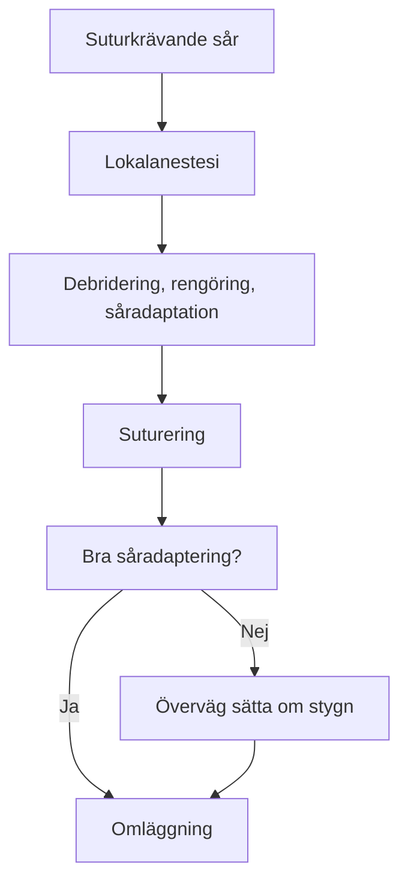
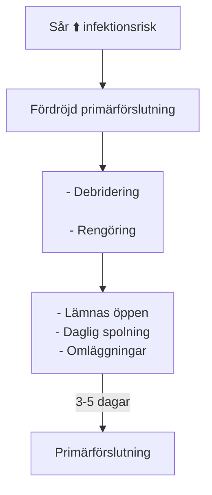

# Sårvård på akuten

::: info Översiktlig kunskap och handläggning av traumatiskt orsakade sår. 
Sårklassifikation, sårhantering, suturering, antibiotika. Denna korta artikel ska ge klinikern en känsla för enklare sårhantering på akuten.  
Som källa används huvudsakligen _Rosens Emergency Medicine, 10th ed, chapter 50_. 
:::

## HUDBIOLOGI 

###  Anatomi 
::: details Hudanatomi

:::

|  Hudlager                                 | Egenskaper                  | 
| -------------                             | :----------------------            | 
| <gr> **Epidermis** </gr>                  | <ul><li>Ytterst</li><li>Skyddande barriär</li><li>Flera lager</li></ul>         | 
| <ye> **Dermis** </ye>                     | <ul><li>Vävnadsstyrka</li><li>Elasticitet</li><li>Kärl, nerver, hårfolliklar, och körtlar</li></ul>       | 
| <re> **Subkutis (hypodermis)** </re>      | <ul><li>Fett och bindväv</li><li>Insulation</li><li>Energilager</li><li>Stötdämpning</li><li>Större kärl och nerver</li></ul>        | 

::: danger FASCIOR
Viktigt att ytlig och djup fascia rengörs och debrideras ordentligt. Här finns hög risk för att infektion utvecklas och sprids. Dessa kan snabbt övergå till allvarliga infektioner. Om djupa fascian är skadad skall denna repareras innan sårförslutning.
:::

###  Läkningsfaser 
::: details Graf

Källa: “SKIN FUNCTION AND WOUND HEALING PHYSIOLOGY.” (2006).
:::
|  Tid från skada                       | Processer                                                               | Sårkarakteristika
| -------------                          | :--------------------                                                   | :---   
|<ye> 0-1 d HEMOSTAS</ye>                |  <ul><li>Vasokonstriktion</li><li>Koagulation</li><li>Fibrinnät </li></ul>| <ul><li>Mycket instabilt</li><li> Hög risk att det öppnas </li></ul>  
| <re>1-3 d INFLAMMATION</re>       |  <ul><li>Vasodilatation</li><li> Migrering av WBC</li><li> Frisättning tillväxtfaktorer</li></ul> | <ul><li> Rubor, calor, tumor</li><li> Svagt och instabilt</li><li>Fibrinnät som skyddar</li></ul>  
| <bl>3-7 d PROLIFERATION</bl>      |    <ul><li>Angiogenes</li><li>Fibroblastaktivitet</li><li>Re-epitelialisering</li><li>Såret krymper</li></ul>  | <ul><li>Granulationsvävnad, röd, lättblödande</li><li>Fortsatt svagt sår men har integritet</li></ul>
| <gr>> 2 v REMODELLERING</gr>      | <ul><li>Cross-linking av kollagen</li><li>Hämning angiogenes</li></ul>        | <ul><li> Ärrbildning</li><li>< 3 veckor: < 20% ursprungsstyrka</li><li>< 4 mån: 60% av ursprungsstyrka</li><li> Hållfasthet når totalt 80% från ursprunget</li></ul>   

::: info Epitelialisering
<ul>
    <li>Epitel migrerar redan timmar efter sårskada. Orenheter förhindrar denna process. Såret ska vara <i>rent</i>, <i>fuktigt</i>, och <i>skyddat</i>.  </li>
    <li>Om suturering sker < 48h börjar såret redan se läkt ut efter 5 dagar.</li>
</ul>
:::

###   Langerlinjer (Skin tension lines)
::: details Langerlinjer

Källa: José María Arribas Blanco, Shabnan Habibi, Nuria Rodríguez Pata and José Ramón Castello - (2016). "Integrated Activities in Primary Care – Minor Surgery in Family Medicine". 
:::
Sår som går rätvinkligt i förhållande till langerlinjerna producerar större ärr eftersom den högre tensionskraften försvårar läkningen. Det är därför fördelaktigt att vid kirurgiskt orsakade sår röra sig parallellt med langerlinjerna för att minimera ärrbildning.

##  SÅRKLASSIFICERING 

::: info Det är av hög vikt att man lär sig kategorisera typen av sårskada man har framför sig. Beskedliga sår kan missbedömas och leda till djupa infektioner om man inte känner till riskfaktorer och sårmekanismer.
:::

### Surgical Wound Classification (SWC), Center for disease control (CDC)

| Sårklass                            | Fynd                                                                              | Infektionsrisk % Surgical site infection (SSI) 
| ---------------                     | :---------------                                                                |:-------------:   |
| Klass 1 Rent                 | <ul><li>Ingen inflammation</li><li>Sterilt</li><li>Primärförslutning</li></ul> |1 - 5                  |   
| Klass 2 Rent-kontaminerat    | <ul><li>Slemhinnor</li><li>Ingen främmande kropp</li><li>Sterilteknik</li></ul>   |   3 - 11              | 
| Klass 3 Kontaminerat         | <ul><li><re>Oavsiktligt öppet sår</re></li><li>Bruten sterilteknik</li><li>GI kontaminering</li><li>Icke-purulent inflammation</li></ul>                    |  10 - 17               |                
| Klass 4 Smutsigt/infekterat  | <ul><li>Gammalt traumatiskt sår  med icke-viabel vävnad </li><li>Infektionstecken</li><li>Främmande föremål</li></ul>                    |      27           |
 ::: details Källa
 Herman TF, Popowicz P, Bordoni B. Wound Classification. [Updated 2023 Aug 17]. In: StatPearls [Internet]. Treasure Island (FL): StatPearls Publishing; 2025 Jan-. Available from: https://www.ncbi.nlm.nih.gov/books/NBK554456/
:::

Vi kommer ägna oss huvudsakligen åt klass 3 och 4 sår då alla öppna oavsiktliga traumatiska sår betraktas som minst grad 3.

###  Traumatiska sårtyper 

| Typ | Mekanism | Djup | Risk |
|:--|:-----|:--|:--|
| Abrasion (skrapsår)| Hudskrapning/hudflåning | Ytlig | Infektion|
| Laceration  (Kött-, skär-, rivsår)  | Trubbig, slitning, skärning | Ytlig - djup | Blödning/infektion|
| Avulsion (Avslitning, degloving)| Kraftig slitning | Djup | Stor vävnads förlust |
| Punktion (puncture) | Bett, taggar, nålar | Djup | Infektion |
| Penetration | Kniv, kulor | Djup | Intern organskada |
| Kontusion | Trubbigt | Subkutant | Hematom |

## ANAMNES 

::: info För att kunna prognosticera sårets läkningsförmåga och infektionsrisken behöver man ta en god sjukdomshistoria. Detta kan vara avgörande för vilka åtgärder man väljer.
:::  

###  Tidigare / nuvarande sjukdomar / aktuellt 

- Perifer kärlsjukdom (ffa diabetes och claudicatio)
- Immunosupprimerad
- Främmande föremål
- Tetanusstatus

###  Riskfaktorer som ökar infektionsrisk 

- Efter 6 - 12 timmar har man traditionellt betraktat ett sår som klass 4. Detta är omdebatterat idag då sårrengöring blivit så mycket bättre.
- Krosskada: Ofta rejält skadad vävnad utöver huden. Minskat blodflöde till sårkanterna. Ökar bakteriebördan upp till 100 gånger.
- \> 5 cm lång sårskada
- Djup sårskada (> 6 mm; man kan se subcutis)
- \> 65 år
- Höghastighetsprojektil
- Kontaminering: Saliv, jord, feces.
- Punktionsskada (bett, tagg)

::: warning VIKTIGA BEAKTANDEN
- Primärsutur ska ske inom 8 - 12h. Data pekar dock på att timingen inte är lika viktig som dom andra riskfaktorerna eftersom rengöring och debridering blivit så pass bra. UpToDate tycker det går bra upp till 18 timmar.
- Fina och rena ansiktssår kan primärförslutas > 24h efter skadan
:::

###  Sårlokalisation 

Sårlokalisation är en av dom viktigaste faktorerna vid bedömning av infektionsrisk. Lår och framförallt underben har högst risk då kroniska sjukdomar ofta skadar kärl och hudstrukturen kring ankel och underben. Dåliga förutsättningar för sårläkning. Detta gör det särskilt riskabelt om kontamination föreligger.

| Lokalisation | Infektionsrisk efter suturering |
| :---|:----:|
| Ansikte + skalp | < 4% |
| Torso + andra extremiteter | > 10% |
| Lår/underben | <re><b>> 20%</b></re> |

Risk för infektion: Underben > lår > armar > fötter > bröst > rygg > ansikte > skalp

::: tip VÅGMÄSTARE
Det är den sammanvägda bedömningen med alla dessa faktorer som ska ligga till grund för klinikern om såret ska förslutas och om antibiotika är aktuellt.
:::

## STATUS & RADIOLOGI

::: info ATT FÖRSTÅ SÅRET
Ibland kan det vara klurigt att förstå såret och se den för vad den är; framförallt om den blöder och ändrar skepnad hela tiden. Hemostas kan därför blottgöra och förenkla såråskådningen. 

På en sårskadad extremitet kan en blodtrycksmanschett  användas med fördel proximalt om såret samtidigt som man höjer extremiteten 1-2 minuter. Manschetten kan vara på 2 timmar om man så önskar, men sannolikt så kommer patienten vara i så pass mycket smärta att det är självbegränsande.
::: 

::: tip FRÄMMANDE FÖREMÅL
Om man misstänker att ett föremål tagit sig in på djupet men man kan inte se eller palpera den så kan man med fördel nyttja olika typer av radiologi. Valet av bildmodalitet blir beroende på vad för objekt man misstänker. 
- <ye><b>SLÄTRÖNTGEN</b></ye> 
      Metall 99%; Glas 75%;  Trä 7%. 
- <ye><b>SKIKTRÖNTGEN, CT </b></ye>
     Ser alla typer av främmande föremål vilket gör den golden standard. De uppenbara negativa aspekterna är strålning och kostnad. 
- <ye><b>ULTRALJUD</b></ye>
     Bra men kan ibland ge dåligt resultat pga små föremål, luft, ödem, pus, blod, kalcifieringar. 
:::

## HANDLÄGGNING

::: info Nu kommer vi till den viktigaste delen i artikeln, nämligen hur vi stegvis handlägger ett sår.
:::
### Översikt

### Lokalanestesi

####  Val av lokalanestetikum 
::: info SÅRSKADOR PÅ AKUTEN
MEPIVAKAIN (**Carbocain®**)  
LIDOCAIN (**Xylocain®**)  
:::

| Typ | Anslagstid | Duration | Rimlig dos | 
|:----|:----------|:--------|:------|
| Mepivakain| <ul><li>Sekunder</li></ul>|<ul><li>1,5 - 4 h</li></ul>| <ul><li>1-20 ml (10 mg/ml)</li><li>5 mg/kg (maxdos)</li></ul>|
| Lidokain| <ul><li>Sekunder</li></ul>|<ul><li>20-60 minuter</li><li>2-6 h (adrenalin)</li></ul>| <ul><li> 5-40 ml (10 mg/ml)</li><li>4 mg/kg (maxdos)</li><li>7 mg/kg (adrenalin)</li></ul>|

::: details VARFÖR MEPIVAKAIN > LIDOKAIN
* Liknande anslagstid
* Längre duration
* Samma potens
* Mindre toxicitet
* Ej beroende av adrenalin i lika hög grad
:::

::: tip BUFFRA
Carbocain är löst i en låg pH-lösning (pH 4,5 - 6). Agerar antimikrobiellt. Detta betyder också att det gör extra ont vid injektion. Man kan tillsätta 1-2 ml 0,6 M Natriumbikarbonat till 10 ml carbocain.
:::
::: danger ADRENALIN
Fördröjer läkningsperioden. Ökar infektionsrisk. Om högrisksår med omfattande vävnadsskada: överväg avstå adrenalin.
:::

####  Allergi 

::: info 2 familjer inom lokalanestesi
* Amider (Lidokain, Mepivakain, Bupivakain)  
* Estrar (Prokain, Tetrakain, Benzokain)
:::

::: warning KORSREAGERAR INTE
Vid osäkerhet om allergi, injicera 0,1 ml och utvärdera efter 30min
:::

####  Injektionsteknik 

::: details Skolans misslyckande
Av någon bisarr orsak missade jag PM:et där det skall ha framgått att lokalanestesin INTE ska infiltreras i epidermis. Tyckte alltid det var lite märkligt att jag ofta jobbade mot så djävulskt mycket motstånd vid injektionsmomentet. Rent anatomiskt är detta mycket enkelt att förklara. Som beskrivet i denna artikels första del [Anatomi](#anatomi), finner vi sensoriska nervstruktur i dermis/subcutis och INTE i epidermis. Av mycket logiska skäl innebär detta givetvis att vi skall infiltrera djupa delen av dermis (mindre spridning) alternativt ytliga delen av subcutis (större spridning).  
:::

Ett bra nålval som har ett balanserat injektionsflöde (smärta kontra hastighet) är en 23 Gauge nål. I svenska termer motsvarar detta en blå nål. .

När vi har en sårskada framför oss finns det två tillvägagångssätt. Antingen betraktas såret tillräkligt rent för att vi ska kunna injicera direkt i sårkanterna (förslagsvis ytliga delen av subcutis). Detta kommer vara majoriteten av sår och är mindre smärtsamt. I annat fall kan såret vara så skitigt att man kan riskera dra med sig smuts in i vävnaden. Detta vill vi absolut inte göra eftersom vi i princip gödslar med potentiellt infektionsmaterial.

Om du sticker perkutant (via huden), se till att denna är rengjord, förslagsvis med tvål och vatten. Om du är lite ångestladdad kan man även, MED FÖRSIKTIGTHET, använda klorhexidin på frisk hud. Klorhexidin skadar öppna sårytor och förlänger läkning. Sen gör det sinnessjukt ont för patienten

En generellt bra teknik är att man sticker in hela vägen längst med sårkanten tills man når basen av nålen. Därefter aspirerar man, backar långsamt, samtidigt som man injicerar lokalanestesi. Djupet bör vara ungefär 5 mm för att adekvat nå rätt del av dermis/subcutis.

####  Kort om finger-tåblockad och adrenalin 

::: info Sannolikt inte farlig
Tes: Vasokonstriktion av endarterioler -> ischemi  
Case studies från handkirurgi: Säkert med försiktig monitorering. Reverseras med lokalinjektion 0,5 - 2 mg subkutant phentolamin alternativt topikal nitroglycerin.

Om det är svårt att ha blodfritt arbetsfält kan man överväga att tornikera fingret/tån på dess bas med exempelvis ett bandage.
:::

### Sårhantering

::: info Efter man har framgångsrikt välsignat området med lokal analgesi kan sårtvätt börja. Plåga inte patienten i onödan.
:::

####  Debridering och sårtvätt 

::: info DEBRIDERING
Debridering är i särklass ett av dom viktigaste momenten i sårvård. Om kroppsfrämmande föremål och partiklar missas i sår finns en skälig risk att ingen adekvat läkning sker samtidigt som infektionsrisken ökar dramatiskt. Utöver detta kan sårläkning ske på ett ofördelaktigt sätt vilket förändrar anatomin på ett estetiskt eller funktionellt olämpligt vis. 
:::

::: tip SÅRTVÄTT
Efter man plockat bort större och uppenbara föroreningar kommer nästa viktiga steg, vilket är att man tvättar rent såret. Här kan man med fördel använda ljummet kranvatten blandat med tvål. Effektmässigt är kranvatten jämförbart med koksalt. Kranvatten är i princip gratis och lättillgängligt. Koksalt kan reserveras till kirurgiskt sterila sår; sårskador på akuten betraktas redan som kontaminerade. 

Om man inte fysiskt skrubbar i såret ska ett spoltryck på 7 Psi uppnås, detta för att säkerställa att skräp och mikroorganismer sköljs bort utan att skada vävnaden ytterliggare. Ett enkelt sätt att säkerställa att man spolar rätt är att ansluta en 30 mL spruta med en 18G nål (rosa pvk eller röd uppdragningskanyl). Här rekommenderar jag att man använder PVK:n så man undviker skärande våld.
:::

::: warning HÅR
Hår är något av ett gissel vad gäller sårskador. Hamnar i såret, är i vägen när man suturerar, och gör det onödigt svårt. 

⭐ <gr>BÄST:</gr> Trimmer/sax.

OKEJ: Vaselin/oljig substans på sårkant = agerar hårprodukt.

🔴 <re>DÅLIG:</re> Rakhyvel. Skadar hårfolliklars infundibulum vilket skapar enkel bakterieacess. Infektionsrisk ökar 9-faldigt.
:::

### Sårförslutning

####  Primärförslutning  

- Ej infekterat  
- Tid < 12-18 h (rena ansiktssår upp till 48h)

#### Fördröjd primärförslutning

::: info Bra att veta
Samma läkningstid men dramatiskt reducerad infektionsrisk. Om extremitet, omlägges med skena. Oklart huruvida packning är fördelaktigt eller ej. Orsakar mer smärta utan uppenbar vinst. Återbesök 24h för sårkontroll och omläggningsbyte. 
:::

::: danger ANTIBIOTIKA GES INTE TILL DESSA SÅR
:::

### Suturering, stapling, limning, SteriStrip

Här inkluderas de vanligaste och mest användbara sårförslutningsverktygen på en akutmottagning.

#### Suturer

::: details Enkelsutur

:::
::: details Stående madrass

:::
::: details Liggande madrass

:::
::: details Fortlöpande utan låsning

:::
::: details Y-sår

:::
::: details V-sår                           

:::
::: details V-sår med liggande madrass

:::
Hundöra (Standing cone)          
Hundöra (reclining cone)        

#### Stapling

#### Limning - DermaFlex

#### Steristrip

