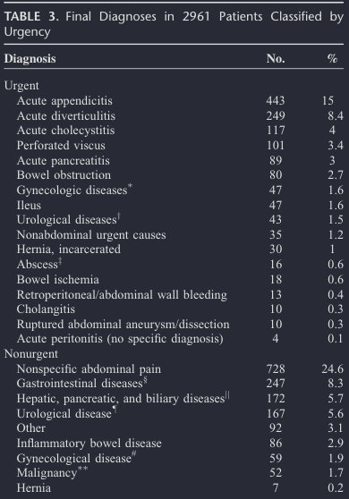
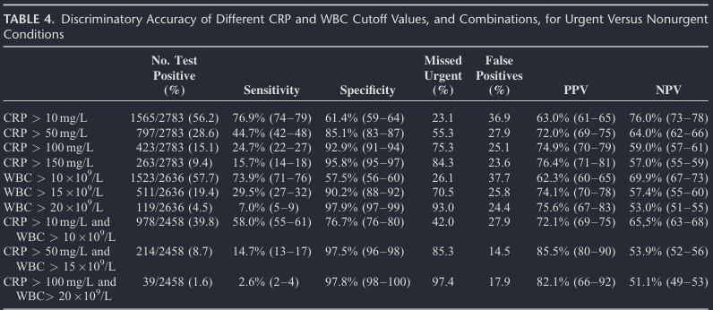

# Hur bra är CRP/LPK på att förutspå allvarlig sjukdom?

Det är ett faktum att blodprover spelar stor roll i vår kliniska vardag. Prover tas på löpande band utan större konsekvenstänk- allt för att minska tiden på akuten. Detta medför stor risk för falskt positiva och bidrar till överutredning. Detta är särskilt sant för CRP/LPK-stegringar där båda är associerade till graden av allvarlig sjukdom. Av detta att härleda minskar tröskeln dramatiskt för att utföra bilddiagnostik trots att den kliniska undersökningen vittnar om benign sjukdom. 

#### STUDIE

Meta-analys av <Ref label="Gans et al" citation="C-Reactive Protein and White Blood Cell Count as Triage Test Between Urgent and Nonurgent Conditions in 2961 Patients With Acute Abdominal Pain" url="https://doi.org/10.1097/md.0000000000000569" :superscript="false" fontSize="1em"/> från 2015 med ca 3000 patienter som inkluderat 3 stora prospektiva kohortstudier med akut buk. Två från Nederländerrna, och en från Sverige. 

| PICO         | INNEHÅLL                                                        |
|--------------|-----------------------------------------------------------------|
| POPULATION   | Patienter med akut buk på akuten.                               |
| INTERVENTION | Använda CRP och LPK som triageprover.                           |
| COMPARISON   | Klinisk undersökning som triage utan CRP/LPK.                   |
| OUTCOME      | Provernas förmåga att särskilja på akut vs icke akut bukåkomma. |

_Hjälper CRP/LPK att identifiera akuta tillstånd än icke-akuta hos patienter med buksmärta på akuten och kan proverna användas som ett "snabbtriage" för bilddiagnostik?_

#### RESULTAT

Vad som ansågs vara AKUT och ICKE AKUT

I majoriteten av patienterna togs CRP (93,9%), LPK (89%), och båda tillsammans (82,9%).

Studien konkluderar att CRP och LPK är inadekvata tester att använda som triageinstrument för att selektera fram bilddiagnostik hos patienter med akutbuk, detta trots duration > 48h. Det principiella problemet är att proverna ensamma men också tillsammans har dålig sensitivitet, framförallt vid ökande tröskelvärden. Specificiteten blir bättre vid högre tröskelvärden men på signifikant bekostnad av sensitiviteten.

Vid CRP > 50 + LPK > 15 fick man det hösta PPV (85,5%) men missar också störst andel urgent cases (85,3%). Som regel blir specificiteten mycket bra vid LPK > 15 och CRP > 50 (> 95%) vilket gör testerna bra för rule in (SpIn). Tyvärr missas för många urgent cases och kan således inte användas som rule-out (SnOut).

#### SVAGHET
Den viktigaste svagheten i studien är det faktum att proverna inte är sammankopplade med en klinisk undersökning. En studie som utforskar ett triagesystem med översiktligt bukstatus och vitalparametrar kan med all sannolikhet göra proverna betydligt mer användbara för att snabbt motivera bilddiagnostik.

::: info BOTTOM LINE
Högkvalitativ studie. CRP och LPK kan inte användas som ensamt instrument för att motivera bilddiagnostik. En viktig takeaway är att durationen av symptomdebut hade föga påverkan på provernas prediktiva förmåga för urgent cases.
:::