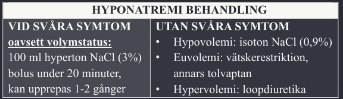
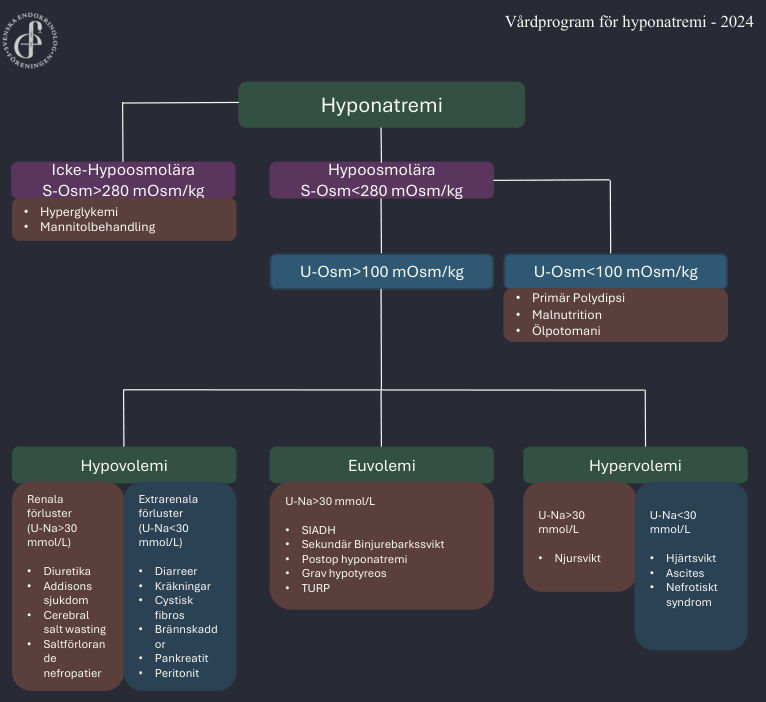

# Hyponatremi

[[Vårdprogram hyponatremi 2024]](https://endokrinologforeningen.se/nyheter/svenska-vardprogrammet-for-hyponatremi-ar-uppdaterat/)

[[Kalkylator för natriumkorrigering vid hypovolem hyponatremi]](../Verktyg/vatskebehandling-hypovolem-hyponatremi.md) 
[[Kalkylator korrigerat natrium vid hyperglycemi]](../Verktyg/korrigeratnatrium.md)

## BAKGRUND

Defineras som P-Na < 135 mmol/L. Förekommer upp till 15-30% av sjukhusvårdade patienter och är den vanligaste elektrolytrubbningen. Dessa pat. har en ökad mortalitet som är relaterad till hyponatremigraden. 

Hyponatremi ska i princip alltid utredas eftersom <re>allvarliga sjukdomar</re> kan ligga till grund för rubbningen. Behandlingen ska syfta till att åtgärda den underliggande orsaken samtidigt som man korrigerar försiktigt (beroende på akut/kronisk). 

De allra flesta är kroniska och kan åtgärdas under lugna förhållanden. Akutbehandling blir aktuell vid: 
1. <ye>Akut grav hyponatremi (P-Na < 115 + < 48h duration) med neurologisk påverkan</ye>
2. <ye>Kronisk hyponatremi P-Na < 120 + neurologisk påverkan</ye>

::: details Osmotiskt demyeliniseringssyndrom (ODS)
Vid för snabb korrigering av P-Na riskerar man att utveckla ODS. Hjärncellerna har anpassat sig till låga natriumnivåer genom att minska osmotiskt aktiva partiklar i cellerna. Vid tillförsel av natrium ökar osmolaliteten i blodet vilket drar vätska till sig från cellerna. Vid för hastig korrigering skrumpnar framförallt oligodendrocyter som underhåller nervernas myelin. Dessa celler har dålig tolerans för membranstress och kan gå i nekros vilket leder till förlust av myelinet. Drabbar främst alkoholister och undernärda äldre.

Detta är ett mycket sällsynt tillstånd och drabbar uppskattningsvis 3-10 pat/år. <Ref label="1" citation="Incidence of osmotic demyelination syndrome in Sweden: A nationwide study" url="https://doi.org/10.1111/ane.13150" :superscript="true" fontSize="0.5em"/>
:::

Vid den akuta bedömningen är det av stor vikt att man särskiljer på typer av hyponatremi då detta styr utredning och behandling. Kategorier, utredning, och behandling utvärderas översiktligt i denna artikel från akutens perspektiv.

## EPIDEMIOLOGI

Ett estimat är att prevalensen inom populationen är kring 5% och att ungefär 3% av patienterna på akuten har hyponatremi.<Ref label="2" citation="Hyponatremia StatPearls" url="https://www.ncbi.nlm.nih.gov/books/NBK470386/" :superscript="true" fontSize="0.5em"/> <Ref label="3" citation="Epidemiology and characteristics of hyponatremia in the emergency department" url="https://doi.org/10.1016/j.ejim.2012.10.014" :superscript="true" fontSize="0.5em"/>

Från internationellt material kan man utläsa följande data i fördelningen av hyponatremityper:

| TYP        | ANDEL, % | ORSAKER                                     |
|------------|:--------:|---------------------------------------------|
| Euvolem    |    50    | SIADH, läkemedel, endokrin                  |
| Hypervolem |    20    | Hjärtsvikt, levercirros, nefrotiskt syndrom |
| Hypovolem  |    20    | Diarrér, diuretika, dehydrering             |
| Annat      |   <10    | Polydipsi, addison's, potomani              |

En viktig reflektion att hämta från <Ref label="Olsson et al" citation="Epidemiology and characteristics of hyponatremia in the emergency department" url="https://doi.org/10.1016/j.ejim.2012.10.014" :superscript="false" fontSize="1em"/> är att det oftast finns 2-3 etiologier till hyponatremi. De ledande orsakerna är:

| ORSAK                         | ANDEL, % |
|-------------------------------|:--------:|
| Tiaziddiuretika               |    17    |
| SIADH                         |    17    |
| Annan diuretika               |    14    |
| Hypervolem                    |    11    |
| Hypovolem pga kräkning/diarré |    10    |
| Alkoholmissbruk               |    7     |

## KLINIK

| Allvarlighetsgrad | Plasmanatrium mmol/L |
|-------------------|:--------------------:|
| Lätt              |       130-134        |
| Måttlig           |       125-129        |
| Svår              |        < 125         |

| Allvarlighetsgrad | Symptom                                             |
|-------------------|-----------------------------------------------------|
| Lätt              | Illamående, kräkningar, huvudvärk, svaghet, anorexi |
| Måttlig           | Konfusion, desorientering, gångataxi                |
| Svår              | Kramp, koma, tydligt påverkat allmäntillstånd       |

Symptomen är avgörande för bedömningen av svårighetsgraden. Man kan exempelvis ha ett P-Na på 123 utan uppenbara symptom men ett värde på 128 och ha neurologisk påverkan. En förklaring är sannolikt att den absoluta majoriteten är kroniskt orsakade hyponatremier där kroppen haft gott om tid för att anpassa sig.

Akut hyponatremi brukar orsaka symptom som anorexi, illamående och kräkningar, samt generell svaghetskänsla. Dessa står i proportion till hur snabbt natrium sjunker och till vilken grad. Allvarliga symptom kan förväntas vid en minskning < 120 inom 24-48 h. Här kan man se kramp, koma, och inklämning. 

## TYPER AV HYPONATREMI

1. [Euvolem hyponatremi](#euvolem-hyponatremi) "Sjuklig vattenretention"
2. [Hypovolem hyponatremi](#hypovolem-hyponatremi) 
3. [Hypervolem hyponatremi](#hypervolem-hyponatremi) "Blöt på utsidan, men torr på insidan"
4. [Iso- och hyperosmolär hyponatremi](#iso-och-hyperosmolar-hyponatremi) "Hyperlipidemi och hyperglykemi"

### Euvolem hyponatremi

Den vanligaste typen av hyponatremi på akuten. Den karaktäriseras av en lätt ökning av total body water (TBW) extracellulärt med en samtidig utspädning/förlust av natrium. Detta drabbar framförallt äldre som ofta har polyfarmaci i form av diuretika och antidepressivum. 

Denna typ av hyponatremi är oftast kronisk eller har en okänd duration. I praktiken handläggs dessa alltså som kroniska hyponatremier såtillsvida orsaken inte är tillförsel av stora mängder hypoton vätska (eg vid TURP).

ORSAKER:
1. SIADH (vanligast)
2. Thiaziddiuretika (SIADH-liknande)
3. Psykogen polydipsi, grav hypotyreos, tillförsel av hypoton vätska

#### SIADH (Syndrome of Inappropriate ADH secretion)

Antidiuretiskt hormon (ADH) stiger till följd av intravasal hypovolemi (baroreceptorer) eller ökad serumosmolalitet (osmoreceptorer i hypothalamus). Insöndras via neurohypofysen. I njuren rekryteras aquaporiner i uppsamlingsrören vilket ökar vattenabsorption och minskar förmågan att koncentrera urin. Vid SIADH insöndras för mycket ADH i förhållande till serumosmolalitet. Ett annat sett att se det är att ADH insöndras oberoende av kroppens vattenbehov.

Eftersom serumosmolaliteten minskar i förhållande till den intracellulära förflyttas vätska intracellulärt. Detta innebär att stor del av den ökade vätskevolymen befinner sig intracellulärt. Patienten kan således hålla sig euvolem lång tid innan dekompensering sker. Utöver detta utsöndras också natrium till följd av natriuretiska peptider som insöndras pga ökad volymbelastning på förmak och kammare. Detta gör att natrium både späds ut och förloras via njuren.

| GRUPP         | ORSAKER                                                               |
|---------------|-----------------------------------------------------------------------|
| Läkemedel     | SSRI, TCA, neuroleptika, opioider, metotrexat, litium                 |
| Malignitet    | Lunga, GI, prostata, lymfom, sarkom                                   |
| CNS-sjukdomar | Pneumoni, lungabscess, tuberkulos, aspergillos, astma, cystisk fibros |

<bl>Värt att lägga på minnet är att SIADH är en UTESLUTNINGSDIAGNOS!</bl>

### Hypovolem hyponatremi

Beskrivs som "Hyponatremi med dehydrering". Här har vi samtidiga förluster av natrium och TBW. Natriumförlusterna överstiger vattnets i proportion. Det måste alltså finnas något som aktivt orsakar förlusterna av natriumet utöver njuren. Man delar in dessa som extrarenala och renala förluster.

#### Extrarenala (U-Na <30 mmol/L)
1. Svettning (långdistanslöpare), diarré (gastroenterit), kräkningar
2. THIRD SPACING: Ileus, brännskador, abdominell sepsis, pankreatit

::: details THIRD SPACING
"Gömd hypovolemi med ADH-medierad vattenretenion". Vatten fastnar extravasalt tillföljd av patologi. Kroppen blir intravasalt uttorkad och aktiverar RAAS och ADH. Vatten retineras i högre proportion än natrium varför natrium späds ut. Patienterna är "wet on the outside but dry on the inside".

Ileus <ye>➨</ye> ↑ tarmsekretioner + ↑ inflammatorisk vätska i tarm <ye>➨</ye> Sekvestering av vätska i tarmlumen <ye>➨</ye> ↓ intravasal vätska <ye>➨</ye> 
Hypovolemi <ye>➨</ye> ↑ ADH + ↑ Na-retention <ye>➨</ye> ↑↑↑ Vatten + ↑ Na <ye>➨</ye> Natrium späds ut
:::
 
::: warning Exempelscenario
Maratonlöpare springer ett lopp <ye>➨</ye> Förlust av natrium och vatten via svettning <ye>➨</ye> Låg effektiv cirkulerande volym <ye>➨</ye> Baroreceptorer signalerar <ye>➨</ye> ADH frigörs <ye>➨</ye> Späder ut natrium
:::

#### Renala (U-Na >30 mmol/L)

1. Diuretika, MRA, ACEi/ARB, Binjurebarkssvikt, Saltförlorande nefropatier
2. Osmotisk diures till följd av svält, diabetes, och ketoacidos

Dessa patienter blir sjukare av hypoton vätska eftersom det fortsätter späda ut natriumet. Njurarna har svårt att göra sig av med överskottsvätskan pga ADH-påslaget. 

### Hypervolem hyponatremi

Patienten är "torr på insidan men blöt på utsidan". Patienterna har oftast ödem, "blöt". Hyponatremin är samtidig som ECF är ökad. Beror på Natrium- + vattenretention där vatten > natrium. Totalnatrium sett till baslinjen är förhöjd men eftersom TBW är samtidigt rejält förhöjt sker en utspädningseffekt. Vätskeretentionen beror på hypoperfusion av njuren ➨ ↑ RAAS ➨ ↑ Aldosterone + ↑ Vattenabsorption.

#### ORSAKER

1. Hjärtsvikt
2. Leversvikt med ascites
3. Nefrotiskt syndrom
4. Kronisk njursvikt

U-Na bör vara lågt, med undantag njursjukdom, som följd av natriumretentionen.

### Iso- och hyperosmolär hyponatremi

Dessa är mindre kliniskt signifikanta ur ett behandlingssperspektiv. 

#### Isosomolär 

Hyponatremin är ett felvärde, "reading error", till följd av förekomsten av stora partiklar i serum som inte bidrar till osmolaliteten relativt natrium. Inget vattenskifte sker. Orsaker inkluderar hypertriglyceridemi, hyperproteinemi, och bristande provtagningsteknik (ex nära infusioner).

#### Hyperosmolär "translokations hyponatremi"

Totalnatrium och total body water är oförändrat men ett vattenskifte har skett till ECF till följd av en osmotiskt aktiv partikel som inte är natrium. Detta beror på hyperglykemi med associerade tillstånd hyperosmolärt hyperglykemiskt syndrom (HHS) och diabetisk ketoacidos (DKA). 

[[Kalkylator korrigerat natrium]](../Verktyg/korrigeratnatrium.md)

## DIAGNOSTIK

| ANAMNES      | PROVER              |
|--------------|---------------------|
| Tidsförlopp  | P-Na + U-Na         |
| Vätskebalans | S-Osm + U-Osm       |
| Läkemedel    | Överväg hormonpanel |

Kännetecknande för SIADH är euvolemi, låg S-osmolalitet <275, U-osm >100, förhöjt U-Na>30 (natriuretisk peptid), normal tyroidea-, njur-, och binjurebarksfunktion, ingen användning av diuretika senaste dagarna.

## BEHANDLING

#### Vårdnivå

Svår symptomgivande hyponatremi, e.g somnolens, kramp, etc., kräver intensivvård. IMA bör övervägas för patienter med risk för ODS vid korrigering eller annan behandling utöver vätskekarens där tät monitorering är viktig. Vid neurologiskt habitus kan de flesta handläggas på vanlig vårdavdelning. 

#### Utlösande faktor

Orsak till hyponatremi ska behandlas och läkemedel som kan bidra seponeras.

### Svår hyponatremi 

#### Svåra symptom

På grund av låg osmolalitet i blodet dras vätska till celler som har högre osmolalitet. Detta leder till hjärnödem och är livshotande. I ett sånt läge är det indicerat med hyperton natriumklorid 3%.

::: warning AKUTBEHANDLING
100 ml natriumklorid 3% iv under 20 minuter. Kan upprepas 2 gånger med 20 minuters mellanrum. Målet är att snabbt korrigera tills symptomregress. En bolus på 100 ml höjer i snitt P-Na 2-4 mmol/L. Prover ska tas minst 2 gånger under första timmen.
:::

::: tip INGET 3% NaCl?
Blanda 160 mmol Na (4 flaskor 10ml Addex-Natrium 4 mmol/ml) i 500 ml 0,9% NaCl.
:::

Den totala korrigeringen bör inte överstiga 6 mmol/L/24h. Denna tröskel kan sänkas till 4 mmol/L/24h om man har en ökad risk för ODS (alkoholister, malnutrition, hypokalemi, mycket lågt P-Na).

#### Utan svåra symptom

1. Hypervolem?  <gr>Loopdiuretika. </gr>
2. Euvolem?  <gr>Vätskekarens</gr> 1 L/d. Här bör beaktning tas för patienter som har en nedsatt förmåga att utsöndra vatten, vilket gör behandlingen ineffektiv. För att estimera detta kan man räkna Urin/Plasma elektrolytkvot:

    

    $$
    \mathrm{Kvot}=\frac{U\mathrm{-}Na+U\mathrm{-}K}{S\mathrm{-}Na}
    $$
    _Om ≥ 1 innebär låg sannolikhet att patienten kommer svara på vätskekarens. Tolvaptan bör övervägas, startdos 7,5 mg varje eller varannan dag. Tolvaptan ges ALDRIG samtidigt som vätskekarens pga risk för överkorrigering och risk för ODS. Diskutera med njurkonsult._
    

3. Hypovolem?  Behandlas med isoton 0,9% NaCl. För att räkna ut ett 24-timmars mål på 6 mmol/L kan denna kalkylator användas:

    [[Natriumkorrigering vid hypovolem hyponatremi]](../Verktyg/vatskebehandling-hypovolem-hyponatremi.md)

4. Hypovolem eller Euvolem?  
    I detta skede kan man ge patienten 0,5-1 L 0,9% NaCl på 6-8 timmar och därefter provta. Om P-Na stiger är den hypovolem, om den minskar är den euvolem.

### Monitorering

Vid symptom bör provtagning tas generöst, gärna varje till varannan timme tills det att symptomen gått i regress och korrigeringstakten minskats. Mät vätska in och dygnsurin. Timdiures är en viktig markör, om denna plötsligt ökar kan det stå för att ADH-aktiviteten minskar som då kan leda till en för snabb korrigering.

## KÄLLOR

1. <gr>Rosen's textbook of Medical Emergency - Hyponatremia</gr>
2. [Internetmedicin - Hyponatremi](https://www.internetmedicin.se/endokrinologi-och-diabetologi/hyponatremi)
3. [Vårdprogram Hyponatremi](https://endokrinologforeningen.se/nyheter/svenska-vardprogrammet-for-hyponatremi-ar-uppdaterat/)
4. <gr>Diverse externa källor som refereras specifikt till i löpande text.</gr>