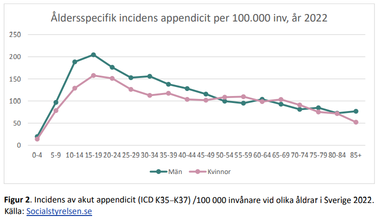

# Appendicit

## Epidemiologi

| <gr> Sjukdom </gr>            | <gr> Incidens </gr>             |    <gr> Fall / år </gr>  |
| -------------                 | :-----------:                   |     :-------:
| <ye> **Appendicit** </ye>     | <ye> **120 / 100 000** </ye>    |   <ye>  **11 000**   </ye>
| Influensa (jämförelse)        | 5000 / 100 000                |     500 000

## Undersökningar

