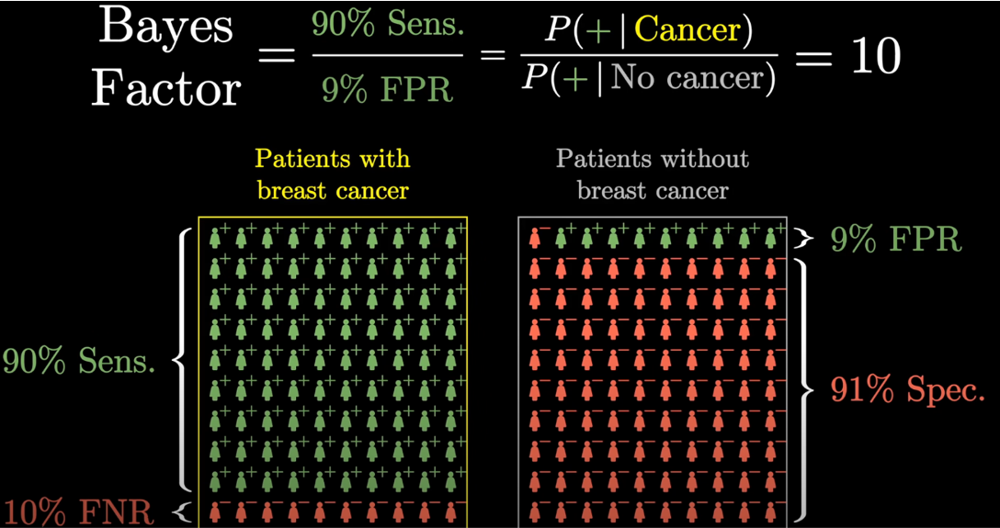

# 4. Likelyhood ratio (LR), i.e _Bayes factor_

::: info Anger hur meningsfullt en undersökning förändrar sannolikheten för den sjukdom man undersöker för. Den hjälper klinikern att kalibrera sin intuition. Påverkas inte av prevalens.
:::

Kalkyleras genom:

LR (+)      =       $\frac{\Large{\text{Sensitivitet}}}{\Large{\text{False\;positive}}}$ 

_eller_

LR (+)      =       $\frac{\Large{\text{Sensitivitet}}}{\Large{\text{1 - Specificitet}}}$   

_och_

LR (-)      =       $\frac{\Large{\text{Specificitet}}}{\Large{\text{False\;negative}}}$

_eller_

LR (-)      =       $\frac{\Large{\text{Specificitet}}}{\Large{\text{1 - Sensitivitet}}}$

::: details Bayes factor (bild)

_Tagen från youtubekanalen 3Blue1Brown under standard youtube license._
:::

Det fina med likelyhood ratio är att det är ett statistiskt värde som är intuitivt och enkelt att applicera. Likelyhood ratio är ett odds begrepp vilket innebär att man konverterat sannolikhet (probability) till odds. Odds utrycks i form av ett sannolikhetsförhållande.

__Exempel__

> <bl> En patient har 50% chans att ha sjukdomen. Alltså ett 1:1 odds, eller förenklat 1. Man har 1:1 odds att få krona när man singlar slant eftersom ett mynt bara har två sidor. </bl>

Om man då har en undersökning med ett likelyhood ratio på 5 förändras sannolikheten att man har en sjukdom på följande sätt:

> <bl> Om odds är 1 multipliceras denna faktor med LR, 5 i detta fall. Odds blir då 5 och motsvarar i sannolikhet ca 0.82.  </bl>

## Sannolikhetsestimeringar

::: info Som regel får vi inte bättre undersökningar än likelyhood ratios på 10 respektive 0.1. Dessa motsvarar en ungefärlig förändring av pretest probability med 45% respektive -45%, alltså en signifikant förändring av pretest probability. Detta motsvarar en sensitivitet och specificitet på 90%. 
:::

|   Likelyhood ratio  |  Ungefärlig sannolikhetsförändring      
| ------------- | :-----------:             | 
| 10    | +45%          | 
| 5      | +30%          |
| 2     | +15%              |
| 1     |  0%         |
| 0.5  |-15%             |
| 0.2  | -30%        |
| 0.1  | -45%        |

## Bottom line

* Hjälper klinikern att snabbt uppskatta en undersöknings förmåga att förändra pretest probability.
* I den kliniska vardagen utförs dessa rimlighetsbedömningar intuitivt utan att man tänker på det men med hjälp av ett faktiskt matematiskt värde kan man finjustera och kalibrera just denna intuition så man får en större träffsäkerhet i diagnostiken. 
* Ett LR på 1 är en värdelös undersökning. LR 10 eller 0.1 är mycket bra undersökningar.